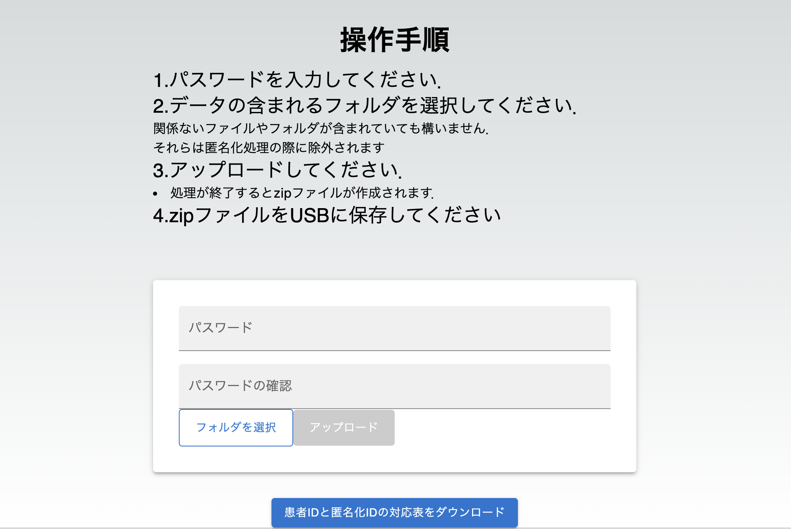

# 心電図データ匿名化アプリ
## 使用言語


## 概要
- 心電図データ(mwfおよびxml)に含まれる個人情報を削除し匿名化するwebアプリケーションです

## 環境
- Node.js 18.17.1(docker)
- Go 1.22.1(docker)

## インストール手順
```bash
git clone https://github.com/shikidalab/anonymize-ecg.git
cd anonymize-ecg
mv .env.sample .env 
# DOWNLOAD_DIRに，csvをダウンロードしたいパス(ローカル)を指定する
# SAVE_DIRにはcsvがダウンロードされるのコンテナ内のパスを指定
docker compose run -w /app --rm front npm install 
docker compose up
```

## 操作方法
- http://localhost:3000 にアクセスしてください


### 匿名化方法
- パスワードを入力してください
- 匿名化するデータの含まれたフォルダを選択してください
  - 関係ないファイルやフォルダが含まれていたも構いません
- アップロードボタンからアップロードしてください
- zipファイルがブラウザからダウンロードできます
- USBにダウンロードしてください

### 患者IDと匿名化IDの対応表のダウンロード
#### web GUIからのダウンロード
- 対応表のダウンロードにはパスワードは不要です
- 一番下の「患者IDと匿名化IDの対応表をダウンロードをクリックしてください」
- ブラウザからcsvがダウンロードが可能です

### CLIでのダウンロード
- `go run main.go -export`でcsvをダウンロードできます
- コンテナ内で実行したい場合は`docker compose run --rm front go run main.go -export`でダウンロード可能です
- ダウンロード先は`.env`に指定した`DOWNLOAD_DIR`です
